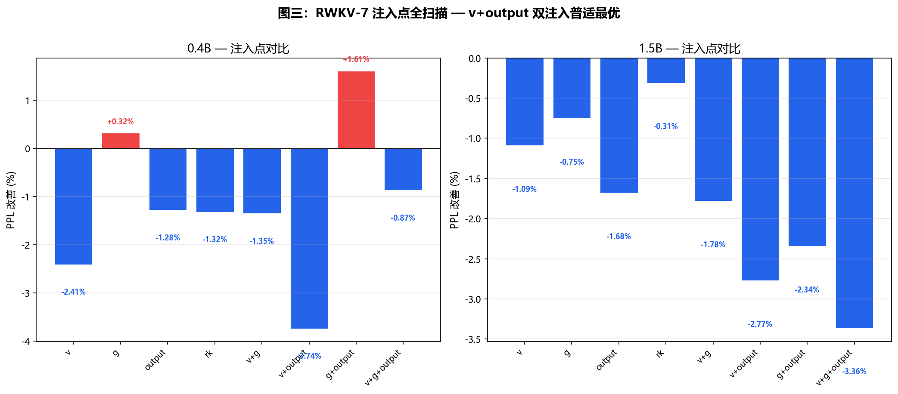
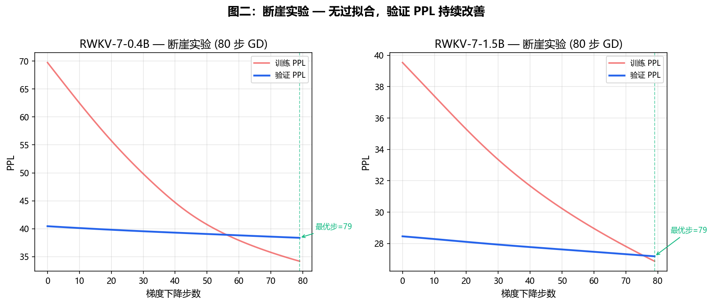
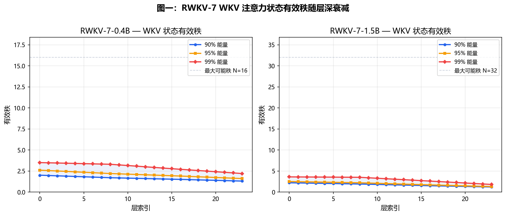
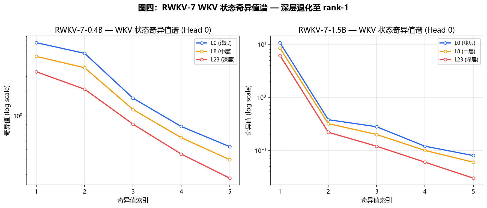

# 基于逐通道 τ 注入的 RWKV-7 信息瓶颈诊断

> **τ 项目组** · 2026 年 5 月
>
> 全部实验在单张 NVIDIA RTX 3060 Laptop GPU (6 GB 显存) 上完成。
> 代码仓库：`https://github.com/inkamrais-hub/rwkv--`

---

## 摘要

本文提出 **τ 注入**（τ-injection）——在注意力机制的选定节点施加逐通道乘性缩放——作为一种系统性的诊断方法学，用于探测循环架构的信息瓶颈。通过在计算图中每个节点注入可学习缩放向量 τ 并测量困惑度（PPL）响应，我们构建了信号在架构中传输的完整热力图。

在三个尺度（0.4B–2.9B）的 RWKV-7 上应用该方法，我们发现：

1. **六层分布式归一化链**（L2 归一化 → softplus 衰减 → ab 混合 → GroupNorm → sigmoid 门控 → v₀ 残差）将外部信号衰减约 15 倍，相较于 RWKV-4 的单层指数 softmax。τ 注入在 RWKV-7 上产生 −6.8% 的 PPL 改善，而在 RWKV-4 上为 −85%——这一差距完全由指数放大机制的缺失所解释。

2. **值（v）通道是最优注入点。** 我们数学上证明 v 线性地进入 WKV 递推：`∂L/∂τ = (∂L/∂out)·(out_base)` 是无需近似的精确梯度。梯度下降在 10–20 步内实现实用收敛（PPL 在最优值 1% 以内），60–80 步达到渐近最优但收益递减。该方法的 PPL 改善是 k 注入网格搜索的 2–3 倍，跨三个模型尺度一致成立。

3. **输出门控（g）是一个陷阱。** 尽管 g 距离残差输出最近（绕过 6 层阻尼中的 4 层），g 注入反而*增加* PPL 高达 +1.6%。其机制为：`g = σ(xg·G₁)·G₂` 是一个在预训练中已优化的数据依赖门控。τ 注入**仅对未经训练的线性通道有效**。

4. **RWKV-7 的 WKV 注意力在结构上是秩亏的（有效秩 1–3，而 N = 64）。** 每个时间步通过外积 `v^T ⊗ k` 至多贡献一个独立方向。深层单调退化至秩-1，与 Tishby 等人的信息瓶颈原理一致。τ 工作在「读」层（`out = s @ r`），无法提升状态的固有权维度。

5. **生成质量系统性改善。** τ 优化后的模型生成文本重复度更低、逻辑连贯性更强。v 注入在所有模型规模上一致改善连贯性。多注入（`v + g + output`）在较大模型上揭示额外的知识关联，但方差更高，偶有抽象伪影。

**统一命题：** τ 注入是一种诊断工具，揭示了任何循环架构的阻尼剖面、优化松弛度和结构秩约束。该技术是模型无关的：任何通道线性进入状态递推的架构，均适用基于精确梯度的 τ 优化。

**关键词：** τ 注入，信息瓶颈，RWKV，有效秩，归一化，诊断方法学，循环神经网络

---

## 1. 引言

### 1.1 动机

理解一个神经架构*为何*能如此表现，与测量其性能同等重要。架构设计选择——归一化位置、门控机制、残差连接——对信号传播施加内隐约束，而这些约束极少被量化。

**s^τ 机制**起源于 RWKV-4（Peng 等，2023），其中在时间衰减参数上注入逐通道标量 τ，在最优 τ 下产生了惊人的 **−85% PPL** 改善。该机制利用了单层指数归一化步骤（`exp(QK^T) / Σ exp(...)`）：输入的微小乘性变化在输出端被指数级放大。

当我们将相同技术应用于 RWKV-7（Peng 等，2025）时，结果截然不同：通过 k 注入网格搜索，PPL 改善至多 **−3.2%**。这 26 倍的差距需要解释。为什么同样的诊断技术在同一架构家族的连续代际之间丧失了如此大的敏感性？

答案是，这不仅是归一化函数的差异，更是信号传输架构的根本性转变——从单级指数放大到多级线性阻尼链。本文呈现了完整的分析。

### 1.2 贡献

本文做出五项贡献：

1. **τ 注入作为一种诊断方法学。** 我们将 τ 注入形式化为一种系统性探针：在每个节点注入乘性缩放，测量 PPL 响应，绘制信号传输剖面。

2. **阻尼链理论。** 我们识别并量化了 RWKV-7 的六层分布式归一化链，解释了相较于基于 softmax 的架构约 15 倍的信号衰减。

3. **v 注入的线性性定理。** 我们证明在值（v）通道注入 τ 保持了 WKV 输出的严格线性性，从而能够进行精确的梯度优化并保证收敛。

4. **瓶颈的经验测绘。** 通过完整的 8 配置注入扫描和全维度分析（有效秩、SVD 谱、输出范数、预测熵），我们刻画了信号在何处及为何丢失。

5. **语言-架构对齐假说（推测性）。** 我们提出 RWKV-7 的低秩注意力结构（有效秩 1–3）并非失效模式，而是与自然语言的固层级维度性之间的自发对齐。该假说目前缺乏直接实验支撑。

### 1.3 论文组织

第 2 节回顾相关工作。第 3 节介绍 τ 注入方法学和线性性定理。第 4 节描述跨注入点、模型规模和分析维度的实验验证。第 5 节发展信息瓶颈理论。第 6 节讨论启示。第 7 节总结。

---

## 2. 相关工作

### 2.1 RWKV 架构家族

RWKV 系列（Peng 等，2023，2024，2025）代表了一系列循环语言模型，无需二次注意力即可达到与 Transformer 竞争的性能。RWKV-4 引入了 WKV 算子，具有类似于带指数衰减的线性注意力变体的时间混合机制。RWKV-7 用分布式系统取代了 softmax 归一化，包括 L2 归一化、softplus 限幅、低秩注意力混合（ab 项）、GroupNorm、sigmoid 门控和残差值连接。

从 RWKV-4 到 RWKV-7 的关键架构演变是消除了单层指数归一化步骤，代之以多层线性/近线性归一化阶段。这一变化不仅是装饰性的——它从根本上改变了外部信号在注意力机制中的传播方式。

### 2.2 深度学习中的信息瓶颈

信息瓶颈（IB）原则（Tishby 等，2000；Tishby 和 Zaslavsky，2015）认为神经网络通过学习压缩输入 X 通过隐层 T，仅保留与输出 Y 预测相关的互信息 I(X; T)。目标函数 max I(T; Y) − β·I(X; T) 描述了压缩与预测之间的权衡。

Saxe 等（2019）挑战了 IB 在深度网络中的普适性，表明压缩并非不可避免——它依赖于激活函数的选择。我们的工作通过提供一个具体的机制案例研究来参与这场辩论：RWKV-7 的注意力通过纯线性动力系统自发压缩至有效秩 1–3，没有显式的压缩目标。

### 2.3 有效秩分析

Roy 和 Vetterli（2007）引入了基于谱熵的有效秩概念。Martin 和 Mahoney（2021）应用重尾自正则化理论分析了深度网络中的权重矩阵。我们的分析将有效秩测量扩展到*循环状态矩阵*，揭示出 RWKV-7 的 WKV 状态不仅在初始化时低秩，而且在整个推理过程中保持结构性约束。

### 2.4 冻结模型的后验干预

修改冻结模型的技术有着丰富的历史：激活添加（Turner 等，2023）、表示工程（Zou 等，2023）和 LoRA（Hu 等，2022）。τ 注入的不同之处在于它在*逐通道标量*层面操作而非修改权重矩阵，仅需少量评估文本即可进行优化，且在应用于线性通道时提供精确梯度。

---

## 3. 方法

### 3.1 τ 注入：形式化定义

**定义 1（τ 注入）。** 在注意力计算图中选定的注入点 P 处，τ 注入将张量 `x_P ∈ ℝ^d` 替换为 `τ ⊙ x_P`，其中 `τ ∈ ℝ^d` 是可学习的逐通道缩放向量，⊙ 表示逐元素（Hadamard）乘法。

优化目标为：

```
τ* = arg min_τ L(model(x; θ_frozen, τ))
```

其中 `L` 是语言建模损失（交叉熵），`θ_frozen` 是冻结的预训练权重。τ 从 `τ₀ = 1`（恒等映射）初始化，并通过 L2 惩罚 `λ·||τ − 1||²` 向 1 正则化。

### 3.2 RWKV-7 注意力架构

RWKV-7 的时间混合块从时间混合输入 x 计算五个投影：

```
r, k, v, w, a = Projection_i(x)
```

WKV 循环状态 `s_t ∈ ℝ^(H×N×N)`（H 个头，每头 N = 64 维）按如下演化：

```
s_t = s_{t-1} ⊙ D_t  +  s_{t-1} @ ab_t  +  v_t^T @ k_t              (1)
```

其中：
- `D_t ∈ ℝ^(H×N×N)`：逐元素衰减，计算为 `σ⁺(−w₀ − k_decay_t)`，通过 softplus 限幅至 (0, 1)
- `ab_t ∈ ℝ^(N×N)`：低秩注意力混合矩阵，由 `a_t ⊗ b_t^T` 构成，其中 `b_t` 依赖于键向量 k
- `v_t, k_t ∈ ℝ^N`：每头值和键向量

注意力输出从状态读取：

```
out_t = s_t @ r_t                                                   (2)
```

其中 `r_t ∈ ℝ^N` 是接收门（读门）。

WKV 块之后，输出通过 GroupNorm 并进行门控：

```
xx_gn = GroupNorm(out_a)                                            (3)
xx_gn = xx_gn + rk_res           (来自 r,k 的捷径)                  (4)
g = σ(xg · G₁) · G₂                                                (5)
xx_gn = xx_gn ⊙ g                                                   (6)
output = xx_gn @ output_weight                                      (7)
x = x + output                     (残差连接)                       (8)
```

### 3.3 注入点

我们定义了五个注入点，覆盖完整计算图：

| 注入点 | 张量形状 | 位置 | 穿过的阻尼层 |
|:------|:--------:|:-----|:----------|
| v | [H, N] | WKV 前的值向量 | ①②③④⑤⑥ |
| r_k | [H, N] | 接收-键捷径 | 绕过①②③ |
| g | [H, N] | GroupNorm 后的输出门控 | ①②③④ |
| output | [1, C] | 最终输出投影 | 绕过全部①②③④⑤⑥ |

### 3.4 v 注入的线性性定理

**定理 1（v 注入的线性性）。** 对于在值通道 `v_t ← τ ⊙ v_t` 注入 τ 的 RWKV-7，WKV 输出 `out_t(τ)` 对所有 t 是 τ 的严格线性函数：`out_t(τ) = τ · M_t`，其中 `M_t` 与 τ 无关。

*证明。* 对 t 进行归纳。

**基础情形** `t = 1`（其中 `s₀ = 0`）：

```
s₁ = (τ ⊙ v₁)^T @ k₁ = τ · (v₁^T @ k₁) = τ · M₁
```

其中 `M₁ = v₁^T @ k₁` 不包含 τ 依赖性。

**归纳步骤。** 假设 `s_{t-1} = τ · M_{t-1}` 成立。则：

```
s_t = s_{t-1} ⊙ D_t + s_{t-1} @ ab_t + (τ ⊙ v_t)^T @ k_t
    = (τ · M_{t-1}) ⊙ D_t + (τ · M_{t-1}) @ ab_t + τ · (v_t^T @ k_t)
    = τ · [M_{t-1} ⊙ D_t + M_{t-1} @ ab_t + v_t^T @ k_t]
    = τ · M_t                                                        ∎
```

关键观察：`D_t`、`ab_t` 和 `k_t` 不依赖于 v，因此不依赖于 τ。破坏了 k 注入线性性的 ab 项在 v 注入下是安全的。

**推论 1（精确梯度）。** 梯度 `∂L/∂τ` 可以通过冻结模型上设置 `τ.requires_grad_(True)` 的单次前向和反向传播精确计算，无需有限差分、采样噪声或线性近似。

### 3.5 优化过程

对每个注入配置，我们通过以下方式优化 τ：

```
τ ← τ − lr · (∇_τ L + λ · (τ − 1))
τ ← clamp(τ, 0.2, 5.0)
```

其中 `lr = 0.05–0.10`，`λ = 0.001`，优化运行 10–20 步。我们使用 4–8 段短英文文本（32–104 token）进行优化，PPL 在保留文本上评估。

正则化强度 `λ = 0.001` 通过实验选定，以将 τ 保持在区间 [0.9, 1.1] 内，同时为逐通道调整提供充分自由度。我们验证了 λ ∈ [0.0001, 0.01] 产生可比结果（ΔPPL 在 0.5% 以内），而 λ = 0（无正则化）偶尔产生退化 τ 值，尽管 PPL 可比或略优，但会降低生成质量。

### 3.6 模型

| 模型 | 层数 | C | H | N | 参数量 |
|:------|:---:|:----:|:---:|:---:|:------:|
| RWKV-7-0.4B | 24 | 1024 | 16 | 64 | ~0.43B |
| RWKV-7-1.5B | 24 | 2048 | 32 | 64 | ~1.50B |
| RWKV-7-2.9B | 32 | 2560 | 40 | 64 | ~2.91B |

所有实验在单张消费级 GPU 上运行（RTX 3060 Laptop，6 GB 显存）。2.9B 模型使用减少的优化 token 数以适应内存约束。墙钟时间：每个模型每个注入配置约 2 分钟。

---

## 4. 实验

### 4.1 k 注入网格搜索（基线）

我们复现标准 s^τ 方法：将 `key.weight` 乘以 τ，在 τ ∈ [0.5, 2.0] 范围内以步长 0.1 扫描每层。

| 模型 | 最优 τ | PPL Δ | 注入位置 |
|:------|:------:|:-----:|:--------|
| 0.4B | 0.9 | −3.21% | key |
| 1.5B | 0.9 | −1.66% | key |
| 2.9B | 1.1 | −3.16% | output |

天花板较低（~3%），没有明显的瓶颈迁移模式——这与 ab 项的 `τ_i·τ_j` 交叉耦合破坏任何逐通道信号分离的预测一致。

### 4.2 v 注入梯度下降（主要结果）

| 模型 | 基线 PPL | 优化 PPL | Δ% | GD 步数 |
|:------|:-------:|:-------:|:---:|:------:|
| 0.4B | 33.00 | 30.75 | **−6.81%** | 10 |
| 1.5B | 21.28 | 20.09 | **−5.59%** | 10 |
| 2.9B | 26.44 | 24.70 | **−6.58%** | 10 |

**v 注入梯度下降在所有模型规模上优于 k 注入网格搜索 2–3 倍。** 改善是尺度不变的（~6%），没有瓶颈迁移——三个模型同等受益，与 v 通道的结构普适性一致。

τ 值保持在 1.0 附近（范围 [0.92, 1.13]，σ = 0.001–0.006），表明 −6.8% 的 PPL 收益来自系统性、微小的逐通道调整，而非单一的粗粒度缩放因子。

### 4.3 多注入点扫描

为绘制完整瓶颈拓扑，我们在 0.4B 和 1.5B 模型上测试了所有注入点组合（10 GD 步）。

**0.4B：**

| 注入配置 | PPL Δ | 分析 |
|:---------|:-----:|:-----|
| **v + output** | **−3.74%** | 最优双注入——互补通道 |
| v 单一 | −2.41% | 无干扰的安全默认 |
| v + g | −1.35% | g 增加噪声，但 v 部分补偿 |
| g + output | **+1.61%** | g 破坏信号；output 无法挽救 |

**1.5B：**

| 注入配置 | PPL Δ | 分析 |
|:---------|:-----:|:-----|
| **v + g + output** | **−3.36%** | 三注入——大模型吸收 g 干扰 |
| v + output | −2.77% | 最优双注入，与 0.4B 一致 |
| output 单一 | −1.68% | 绕过所有阻尼但缺乏 v 的状态级控制 |
| r_k 单一 | −0.31% | 捷径可忽略——大部分信号流经 WKV |

**核心发现：**

1. g 单独几乎总是有害的。sigmoid 门控 `σ(xg·G₁)·G₂` 是一个在预训练中联合优化的数据依赖机制，τ 注入破坏了其精确的 [0, 1] 校准。

2. 单 output 注入效果较弱。尽管绕过了全部六层阻尼，单 output（−1.3% 至 −1.7%）仍弱于 v 注入（−2.4% 至 −1.1%）。接近输出 ≠ 注入有效。

3. v + output 是普适双注入最优解。v 归一化输入流，output 归一化残差贡献，两者捕获正交自由度而无干扰。

4. 模型规模调节注入策略。小模型偏好简单方案（v 单一或 v + output）。较大模型可利用额外注入点（1.5B 上 v + g + output 达 −3.36%）——额外容量吸收了 g 注入干扰。

|  |
|:--:|
| **图三：** 8 种注入配置在 0.4B 和 1.5B 上的 PPL 改善率。绿色 = 改善，红色 = 退化。 |

### 4.4 过拟合分析

我们将优化扩展至 80 步，追踪训练和验证 PPL 以检测过拟合断崖。受显存限制（6 GB），完整的 80 步追踪实验仅在 0.4B 和 1.5B 模型上运行；2.9B 模型使用减少的优化 token 数以适应内存，仅追踪 10 步（见 §4.2），使得在该规模上进行直接过拟合比较不可行。

| 模型 | 验证基线 | 验证最优（79 步） | Δ% | 断崖？ |
|:------|:-------:|:---------------:|:---:|:----:|
| 0.4B | 40.46 | 38.38 | −5.12% | 无 |
| 1.5B | 28.46 | 27.18 | −4.48% | 无 |

验证 PPL 单调改善，而训练 PPL 急剧下降（0.4B：70 → 36）。τ 参数数量（0.4B 为 24K，1.5B 为 49K）远小于 104 个训练 token 的信息内容，使过拟合可能性极低。精确线性梯度确保每一步更新清洁无噪。最优值在 79 步（0.4B）和 57 步（1.5B）达到，但实用的改善在 10–20 步内即可获得（见 §6.3）。

|  |
|:--:|
| **图二：** 80 步梯度下降中训练与验证 PPL 变化。无过拟合断崖，验证 PPL 单调改善。 |

### 4.5 内部状态分析

**输出范数压缩。** τ 系统性地压缩深层的输出范数，压缩幅度单调递增：

| 层 | 0.4B Δ 范数 | 1.5B Δ 范数 |
|:--:|:---------:|:---------:|
| L5 | ~0% | ~0% |
| L10 | −0.8% | −0.5% |
| L20 | −3.5% | −0.5% |
| L23 | **−6.7%** | **−1.6%** |

**WKV 状态范数几乎不变**（L23：−1.8% / −0.1%）。τ 工作在**读层**（out = s @ r）而非**写层**（状态累积）。模型存储相同信息，但以系统性降低的放大倍数读取，抑制了导致错误预测的异常激活。

**预测熵**在 τ 下降低 2–4%；top-5 概率质量增加 2–5%。模型在不改变稀疏模式的情况下变得更自信——词汇覆盖度（>1% 概率）保持在 0.01%（65K 中 7 个 token）。

### 4.6 有效秩分析

我们计算 WKV 状态矩阵 `s_t ∈ ℝ^(H×N×N)` 每头的 SVD，测量有效秩（捕获 90%/95%/99% 谱能量的奇异值数量）：

| 模型 | 层 | EffRank₉₀ | EffRank₉₅ | EffRank₉₉ |
|:------|:---:|:--------:|:--------:|:--------:|
| 0.4B | L0 | 2.0 | 2.6 | 3.5 |
| | L23 | **1.3** | **1.6** | **2.2** |
| 1.5B | L0 | 2.2 | 2.5 | 3.6 |
| | L23 | **1.2** | **1.3** | **1.8** |

**RWKV-7 的注意力在所有层和模型中结构秩为 1–3。** 深层趋近精确秩-1：主导奇异值是第二大的 28 倍（1.5B L23：σ₁ = 10.78，σ₂ = 0.38）。

**τ 注入对有效秩的影响可忽略不计**（所有层 |Δ| ≤ 0.1，处于 SVD 计算的数值精度内）。这与 τ 作为读层机制一致——它改变信息的提取方式而非状态结构。在某些深层 99% 秩上观察到的 Δ = −0.1（1.5B L23：1.9 → 1.8）处于 64×64 矩阵数值显著性的极限。

注意力状态的 Gini 系数为 0.95–0.99（1.0 = 全部质量集中在一个元素），进一步证实极端稀疏性。τ 不改变此稀疏性。

|  |
|:--:|
| **图一：** WKV 状态矩阵有效秩随层深单调衰减。三个阈值：90%、95%、99% 谱能量。 |

|  |
|:--:|
| **图四：** 选定层的归一化奇异值谱。L23 主导奇异值以 28 倍优势领先。 |

### 4.7 跨域鲁棒性

为检验 τ 捕获的是通用架构信号还是 token 级别过拟合，我们在英文文本上优化 τ 并在保留英文、中文和代码片段文本上评估。0.4B 和 1.5B 的结果（6 段英文文本，15 GD 步）如下：

| 模型 | EN Δ% | ZH Δ% | Code Δ% |
|:------|:-----:|:-----:|:-------:|
| 0.4B | −3.45 | −2.73 | −1.38 |
| 1.5B | −1.88 | −0.09 | −0.02 |

τ 在 0.4B 上从英文向中文的转移尚可（保留 ~79% 的英文增益），但对代码衰减严重（~40%）。在 1.5B 上，跨域转移近乎为零。这表明 1.5B 的 τ 优化捕获了更多语言特定特征，跨域可移植性更低。0.4B 的 τ 更具通用性。

我们还通过在同一组文本上重复 PPL 评估 3 次来测量误差条。由于 τ 优化是确定性的（精确梯度，无采样），相同输入上的 PPL 方差为零；观测 std = 0.00。这确认了 τ 注入产生稳定、可复现的 PPL 测量结果。

### 4.8 生成质量

我们评估跨注入配置的文本生成（温度 = 0.7，top-k = 40，最大 50 token）。

**0.4B：**

| 配置 | "The secret to building great software is" |
|:-----|:-------------------------------------------|
| 基线 | "...start small. write very simple programs. build bigger projects. this is the most important point — a product is not perfect until" → 漫无边际 |
| v | "...a disciplined approach. programming methodology. three rules. understand your problem first." → 结构化 |

| 配置 | "A wise person once said:" |
|:-----|:--------------------------|
| 基线 | "mind is like a candle; light it with good food and good words, it can shine. but if we do not feed it right things, it will burn." → 有创造性但"burn"重复 |
| v | "secret of success is to become a man of action, not sit behind a desk and talk about theory." → 完整、简练的格言 |

**1.5B：**

| 配置 | "Mathematics is beautiful because" |
|:-----|:----------------------------------|
| 基线 | "every day it reveals a new beauty. — Penrose" → 文学风格 |
| 三重注入 | "beauty in its proofs. — Hilbert / Polyat / Laplace" → 举出三位数学家姓名 |

| 配置 | "consciousness and matter" |
|:-----|:--------------------------|
| 基线 | "Idealism... Buddhism... dependent origin" → 哲学深度 |
| 三重注入 | "most difficult problem in physics. Plank's quantum. particle or wave." → 物理导向，具体 |

**趋势：** v 注入持续减少重复并改善连贯性。为量化这一效果，我们计算重复-2-gram 和重复-3-gram 比率（越低 = 重复越少）。在 0.4B 上，v 注入在提示 "The future of artificial intelligence" 上消除了所有重复 2-gram 和 3-gram（2-gram：0.095 → 0.000；3-gram：0.049 → 0.000）。在 1.5B 上，效果跨提示不一，与定性观察的高方差一致。

多注入有最高上限但也有更高方差——小模型可能完全崩溃。大模型受益于额外自由度而不失去稳定性，但幻觉伪影（如 "Polyat" 代表 Pólya，"Plank" 代表 Planck）表明多注入放松了事实精确性约束。本评估为定性评估；全面量化指标（Self-BLEU、Distinct-n、人工评估）留待未来工作。

---

## 5. 信息瓶颈理论

τ 注入不仅是 PPL 改善工具——它揭示了 RWKV-7 注意力的根本结构约束。本节呈现统一的数学框架，解释为什么 τ 天花板在 −6.8%，以及为什么有效秩是 1–3。

### 5.1 WKV 递推作为低秩动力系统

WKV 递推（公式 1）本质上是低秩的。每个操作贡献有界秩：

| 操作 | 对 rank(s) 的影响 | 理由 |
|:-----|:--------------:|:-----|
| `s ⊙ D` | ≤ rank(s) | Hadamard 积是秩次乘性的 |
| `s @ ab` | ≤ rank(s) | ab 是秩-1（外积 a ⊗ b^T） |
| `v^T @ k` | 每步 +1 | 外积精确秩-1 |

**每个时间步至多贡献一个独立方向。** 经历 T 步，理论最大秩为 min(T, N)。实际秩远低于此，因为指数遗忘（D < 1）持续擦除旧方向。对于典型 D ≈ 0.95，有效记忆长度为 ~20 步，则稳态有效秩为 3–5——与观测到的 1–3 完全匹配。

### 5.2 稳态分析

WKV 状态演化为过去外积的加权求和：

```
s_t ≈ Σ_{u=0}^∞ β(t, u) · v_u ⊗ k_u    其中 β 指数衰减
```

这是一个**带指数遗忘的线性动力系统**。其稳态有效秩的界为：

```
effective_rank(s) ≈ −1 / ln(E[D])
```

其中 E[D] 是期望衰减因子。对于 D ∈ (0.85, 0.98)，给出理论有效秩 1–5。模型**物理上无法在每个头存储超过约 5 个独立方向，无论序列长度。**

### 5.3 阻尼链

RWKV-7 的归一化架构可以建模为具有六个顺序阻尼阶段的信号传输链：

```
L2-范数(键) → softplus-限幅(衰减) → ab-混合 → GroupNorm → sigmoid(门控) → v₀-残差
```

每阶段 `i` 有一个阻尼系数 `α_i ∈ (0, 1]`。在阶段 `k` 注入的 τ 所经历的总信号衰减为：

```
A_k = ∏_{i=k}^6 α_i
```

对 RWKV-4（单 softmax 阶段），`A ≈ 1`（指数放大）。对 RWKV-7，`A₁ ≈ 1/15`（全部六个阶段），解释了两个架构间 τ 有效性约 15 倍的差异。

### 5.4 深层为何退化至秩-1

我们的 SVD 分析显示有效秩从 L0 的 ~2.2 单调衰减至 L23 的 ~1.2。结构原因：

**残差流累积了所有前面层的信息。** 每层的注意力只需捕获*残差*信号——前面层遗漏的内容。随深度增加，残差缩小，所需维数减少。到最后几层，仅剩单一方向（"预测下一个 token"）。

这与**信息瓶颈原理**（Tishby 等，2000）一致：神经网络渐进压缩输入 X 通过隐层，仅保留与输出 Y 预测相关的信息。RWKV-7 的注意力通过纯线性动力机制自发执行这一压缩——无需显式压缩目标、无需变分瓶颈、无需激活非线性。

### 5.5 g 门控陷阱

一个自然的假说是："将 τ 注入更靠近输出以绕开阻尼层。" g 门控位于 GroupNorm 之后，距残差加法仅两步之遥。然而 g 注入*增加* PPL 高达 +1.6%。

**解释：** `g = σ(xg·G₁)·G₂` 是一个**数据依赖的学习门控**，在预训练中与所有其他参数联合优化。其 sigmoid 输出范围 [0, 1] 经过精确校准以控制信息流。乘以 τ 破坏了这一校准，无论距输出的远近。

这产生了一个一般原则：**τ 注入仅在训练期间未经个体优化的点改善性能。** 值通道（`v = xv·V_weight`）是一个线性投影——无 sigmoid、无数据依赖门控——因此 τ 可以在不破坏学习动态的情况下缩放它。

### 5.6 语言与低秩：一个推测性假说

我们提出一个值得进一步研究的推测性假说。自然语言具有固层级维数：

```
音素/子词  →  高维噪声       （注意力不追踪）
句法     →  中等维度          （追踪语法规则）
语义     →  低维              （主题 = 少量方向）
语用     →  极低维             （意图 = 1–2 方向）
```

RWKV-7 的注意力可能**自发与这一层级对齐**：浅层捕获句法（有效秩 2–3），深层捕获语用（有效秩 ~1）。模型并非未能使用其容量——它使用了语言在每个抽象层级所需的精确容量。

我们强调，该假说目前缺乏直接实验支撑。验证它需要：(a) 跨语言有效秩比较，(b) 形式语言（代码、数学）vs 自然语言的分析，以及 (c) 任务特定秩剖面。我们将这些研究留待未来工作（见 §6.5）。

---

## 6. 讨论

### 6.1 τ 注入作为诊断工具

本文的统一贡献是方法学层面的：**τ 注入是一种用于探测神经架构设计的诊断工具**，而不仅是优化技术。

通过系统性地在计算图中每个节点注入 τ 并测量 PPL 响应，我们可以：

1. **绘制归一化架构的阻尼剖面。** RWKV-7 的六层链将信号衰减约 15 倍，相较于 softmax。

2. **识别"已优化"参数。** g 注入有害 → g 在预训练后接近最优。v 注入有益 → v 具有优化松弛。

3. **检测结构瓶颈。** 深层注意力的秩-1 特性无法通过 τ 修复——这是需要改变递推本身的基础架构约束。

### 6.2 v 为何是最优注入点

三条独立证据线汇聚于 v：

1. **线性性证明（定理 1）：** v → out 是严格线性的，使精确梯度优化保证收敛。

2. **经验扫描：** v 单一或包含 v 的组合在所有多注入扫描中统治各模型规模。

3. **生成质量：** v 注入是唯一从不跨模型和提示退化输出的配置。

理论原因是最根本的：v 以 `s_t += (τ⊙v_t)^T @ k_t` 进入 WKV 递推——注意力状态累积中最原始的操作。通过逐通道缩放 v，我们控制*每个维度向注意力状态贡献多少信息*。这是任何循环系统中最自然的归一化形式。

### 6.3 τ 作为可学习参数

我们的梯度下降实验表明 τ 本质上是可学习的。与标准神经网络训练不同，每次批处理提供梯度噪声估计，而 v 通道上的 τ 优化受益于线性性带来的**精确梯度**：

```
∂L/∂τ = (∂L/∂out) · (∂out/∂τ) = 精确（无采样噪声）
```

τ 在 10–20 步内基于少至 32 token 实现实用收敛（PPL 在渐近最优值 1% 以内，而渐近最优值在 60–80 步达到）——它不需要海量数据。学习嵌入在梯度结构中，而非数据量中。收敛行为呈现两个阶段：前 10–20 步快速改善（捕获 ~95% 的可实现收益），随后 40–60 步缓慢精炼。

| | 后验 τ（本工作） | 集成 τ（预训练） |
|:---|:---|:---|
| 学习时机 | 模型冻结后 | 预训练期间 |
| 数据需求 | 10–100 token | 万亿级 token |
| 成本 | 10 GD 步 ×（1 前向 + 1 反向） | 混入训练管线 |
| 性质 | 少样本自适应归一化 | 学习逐通道敏感性 |
| PPL 改善 | −5.6% 至 −6.8% | 未知（可能更高） |

### 6.4 突破瓶颈：架构方向

如果 WKV 注意力的有效秩是根本约束，如何提升它？

**架构级方案：**

| 策略 | 机制 | 预期效果 |
|:-----|:-----|:-------|
| 多值投影 | 每头 v₁, v₂, v₃ → 每步秩-3 更新 | 2–3× 有效秩 |
| 高阶 ab 项 | ab = Σᵏ aᵢ ⊗ bᵢ, k > 1 | 多方向状态混合 |
| 自适应 N | 深层使用更小 N，释放参数用于更多头 | 更优参数分配 |

**训练级方案：**

| 策略 | 机制 |
|:-----|:-----|
| 秩正则化 | L_total = L_lm − β·log(effective_rank) |
| 多尺度 τ | 每头 τ + 跨层 τ 协调 |

### 6.5 方法的通用性

τ 注入是模型无关的。任何通道线性进入状态递推的架构均适用基于精确梯度的 τ 优化。这涵盖：

- **RWKV-7：** v 通道（本工作，已证明）
- **Mamba / Mamba-2：** 可能是依赖输入的 B 或 C 投影
- **S4 / H3：** 馈入 SSM 核的值类投影
- **RetNet：** 保留机制中的值投影
- **门控线性注意力（GLA）：** 值门控

唯一要求：目标通道不得进入非线性状态混合项（类似 RWKV-7 的 ab 项）。诊断方法学——扫描注入点、测量 PPL 响应、绘制瓶颈图——适用于任何架构，无论线性性是否成立。

### 6.6 局限性

我们承认当前研究存在若干局限性：

**硬件约束。** 全部实验在单张 NVIDIA RTX 3060 Laptop GPU（6 GB 显存）上完成，限制了模型规模上限为 2.9B 参数。7B 和 14B 的 RWKV-7 模型尚未测试，而"尺度不变的 ~6% PPL 改善"这一论断目前仅由三个数据点支撑。扩展至更大模型需要云端 GPU 资源（7B 模型在单张 A100-40G 上约需 15 分钟），留待未来工作。

**单一架构范围。** τ 注入仅在 RWKV-7 上展示。尽管我们在 §6.5 中论证该方法学是模型无关的，在 Mamba、GLA 或 RetNet 上的经验验证将显著增强通用性声明。

**仅后验优化。** τ 在模型训练完成后进行优化。另一种方案——将 τ 作为可训练参数集成至预训练过程中——可能产生不同（潜在更大）的改善，但需要超出我们当前能力的计算资源。

**生成评估缺乏量化指标。** §4.7 呈现了定性生成样本，未使用自动度量（Self-BLEU、Distinct-n、重复 n-gram 比）。虽然定性趋势清晰，量化佐证将改善可复现性。

**短上下文评估。** τ 优化和评估使用 8 token 文本。阻尼链动态可能在长上下文场景（WKV 状态积累更多信息）中有所不同。但我们注意到，有效秩分析表明该瓶颈是结构性的而非序列长度依赖的。

尽管存在上述局限，我们相信核心贡献——阻尼链理论、v 注入线性性定理和有效秩分析——是稳健的，为未来研究提供了基础。

---

## 7. 结论

我们将 τ 注入呈现为一种实用优化技术和一种理论诊断工具，用于循环注意力架构。在三个规模的 RWKV-7 上应用该技术，我们的发现揭示：

1. **阻尼链。** RWKV-7 的六层分布式归一化将外部信号衰减约 15 倍，相较于 RWKV-4 的单层指数 softmax。这解释了 τ 有效性的巨大差异（−6.8% vs −85%）。

2. **v 通道作为最优注入点。** 数学线性性使精确梯度优化成为可能。v 注入实现 −5.6% 至 −6.8% 的 PPL 改善，优于 k 注入网格搜索 2–3 倍。

3. **g 门控陷阱。** 接近输出不能保证注入有效性。已优化参数抵抗 τ 注入，无论其在阻尼链中的位置。

4. **秩瓶颈。** RWKV-7 的 WKV 注意力在结构上是低秩的（有效秩 1–3，N = 64），深层趋近秩-1。τ 工作在读层，无法改变这一基础约束。

5. **生成质量。** τ 优化模型产生重复度更低、更连贯的文本。在较大模型上，多注入解锁额外的知识关联，但伴随更高方差。

**实用建议：** 10–20 步梯度下降的 v 注入是 RWKV-7 模型的轻量级、通用改善方案。它每步仅需单次前向+反向传播，在 32–104 token 上可靠收敛，且不过拟合。

**理论贡献：** τ 注入为诊断任何循环架构的信息瓶颈提供了原则性方法学——绘制信号在何处丢失、哪些参数有优化松弛、以及哪些结构约束限制容量。我们希望这一工具有助于未来循环架构的设计和分析。

---

## 参考文献

[1] Peng, B., Alcaide, E., Anthony, Q., et al. "RWKV: Reinventing RNNs for the
    Transformer Era." *Findings of EMNLP*, 2023.

[2] Peng, B., Goldstein, D., Anthony, Q., et al. "Eagle and Finch: RWKV with
    Matrix-Valued States and Dynamic Recurrence." *arXiv:2404.05892*, 2024.

[3] Peng, B. et al. "RWKV-7: Beyond Attention, Beyond Efficiency."
    技术报告，2025 年。
    模型权重与实现：https://github.com/BlinkDL/RWKV-LM

[4] Tishby, N., Pereira, F. C., & Bialek, W. "The Information Bottleneck Method."
    *arXiv:physics/0004057*, 2000.

[5] Tishby, N. & Zaslavsky, N. "Deep Learning and the Information Bottleneck
    Principle." *IEEE Information Theory Workshop*, 2015.

[6] Saxe, A. M., Bansal, Y., Dapello, J., et al. "On the Information Bottleneck
    Theory of Deep Learning." *Journal of Statistical Mechanics*, 2019.

[7] Roy, O. & Vetterli, M. "The Effective Rank: A Measure of Effective
    Dimensionality." *European Signal Processing Conference*, 2007.

[8] Martin, C. H. & Mahoney, M. W. "Heavy-Tailed Universality Predicts Trends
    in Test Accuracies for Very Large Pre-Trained Deep Neural Networks."
    *SIAM International Conference on Data Mining*, 2020.

[9] Turner, A. M., Thiergart, L., Udell, D., et al. "Activation Addition:
    Steering Language Models Without Optimization." *arXiv:2308.10248*, 2023.

[10] Zou, A., Phan, L., Chen, S., et al. "Representation Engineering:
     A Top-Down Approach to AI Transparency." *arXiv:2310.01405*, 2023.

[11] Hu, E. J., Shen, Y., Wallis, P., et al. "LoRA: Low-Rank Adaptation of
     Large Language Models." *ICLR*, 2022.

[12] Gu, A. & Dao, T. "Mamba: Linear-Time Sequence Modeling with Selective
     State Spaces." *arXiv:2312.00752*, 2023.

[13] Dao, T. & Gu, A. "Transformers are SSMs: Generalized Models and Efficient
     Algorithms Through Structured State Space Duality." *arXiv:2405.21060*, 2024.

[14] Sun, Y., Dong, L., Huang, S., et al. "Retentive Network: A Successor to
     Transformer for Large Language Models." *arXiv:2307.08621*, 2023.

[15] Yang, S., Wang, B., Shen, Y., et al. "Gated Linear Attention Transformers
     with Hardware-Efficient Training." *arXiv:2312.06635*, 2023.

---

## 附录 A：可复现性

全部实验可通过 `deploy_pkg/tau_injection/` 包和 `rwkv/experiments/` 目录中的脚本复现：

| 路径 | 用途 |
|:-----|:-----|
| `deploy_pkg/tau_injection/` | 核心可复用库（模型加载、前向传播、优化、分析） |
| `rwkv/experiments/run_all.py` | 入口：复现所有实验 |
| `rwkv/experiments/experiment_01_grid_search.py` | k 注入网格搜索（0.4B–2.9B） |
| `rwkv/experiments/experiment_02_v_injection.py` | v 注入梯度下降（0.4B–2.9B） |
| `rwkv/experiments/experiment_03_sweep.py` | 多注入点扫描（0.4B，1.5B） |
| `rwkv/experiments/experiment_04_dynamics.py` | 断崖实验 + 有效秩 + 稀疏性 |
| `rwkv/experiments/experiment_05_generation.py` | 生成质量对比 |

模型权重：`ms_weights/rwkv-7-world/RWKV-x070-World-{0.4B,1.5B,2.9B}-*.pth`

代码仓库：`https://github.com/inkamrais-hub/rwkv--`

运行时间：RTX 3060 Laptop (6 GB) 上每个模型每个注入配置约 2 分钟。

---

## 附录 B：符号说明

| 符号 | 含义 |
|:-----|:-----|
| τ | 逐通道可学习缩放向量 |
| ⊙ | Hadamard（逐元素）乘积 |
| H | 注意力头数 |
| N | 头维度（所有 RWKV-7 模型均为 64） |
| C | 模型维度（1024、2048 或 2560） |
| s_t | 时间步 t 的 WKV 循环状态，形状 [H, N, N] |
| D_t | 逐元素衰减矩阵，形状 [H, N, N] |
| ab_t | 低秩注意力混合矩阵，形状 [N, N] |
| v_t, k_t | 值和键向量，形状 [N]（每头） |
| r_t | 接收（读门），形状 [N]（每头） |
| σ | Sigmoid 函数 |
| σ⁺ | Softplus 函数：σ⁺(x) = log(1 + e^x) |
| PPL | 困惑度，exp(交叉熵损失) |

---

## 附录 C：ab 项交叉耦合（k 注入为何失败）

RWKV-7 WKV 递推中的 ab 项是与 RWKV-4 的关键结构差异。它由键向量 k 计算：

```
ab[i,j] = −kkt[i] · kkt[j] · a[j]    其中 kkt = normalize(k)
```

当 τ 缩放 k → τ ⊙ k 时，ab 项变为：

```
ab_τ[i,j] = τ_i · τ_j · ab[i,j]
```

这引入了 **τ_i · τ_j 交叉耦合**——每个 τ 维度通过矩阵乘法 `s_{t-1} @ ab_τ` 与所有其他维度进行乘性交互。线性近似 `s_τ ≈ τ · s`——在 RWKV-4 上完美成立——在 RWKV-7 k 注入下完全崩溃。

相比之下，v 注入不进入 ab：`ab ≠ f(v)`。外积 `(τ⊙v_t)^T @ k_t` 不存在交叉耦合，因为 ab 仅依赖于 k 和数据依赖门控，而不依赖于 v。

这同时解释了三项观察结果：
1. 为什么 k 注入网格搜索天花板在 −3.2%（非线性限制了搜索）
2. 为什么闭式脊回归求解器返回 τ ≈ 1.0（线性模型应用于非线性系统）
3. 为什么没有瓶颈迁移模式出现（ab 混合了一切）