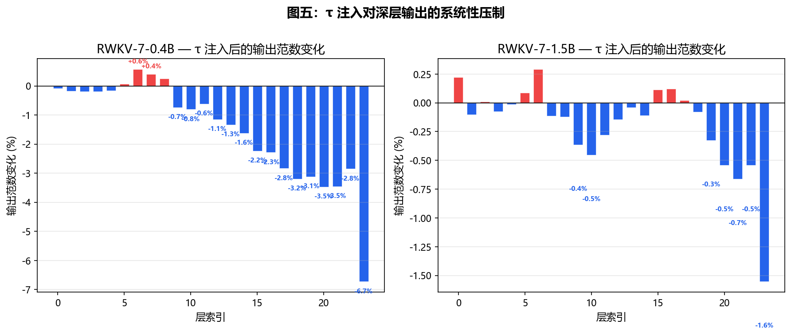
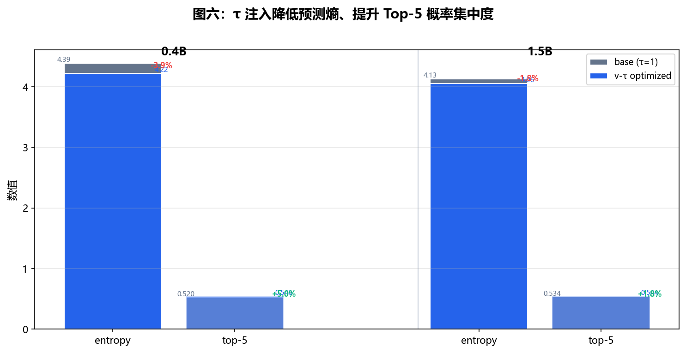

# Probing the Information Bottleneck of RWKV-7 via Per-Channel τ-Injection

> **τ Project** · May 2026 · Single RTX 3060 Laptop GPU (6 GB)
>
> 📄 [PAPER.md](./PAPER.md) · [PAPER_CN.md](./PAPER_CN.md) · [PAPER.html](./PAPER.html)
> 🔗 [s^τ operator: tau-atth111](https://github.com/inkamrais-hub/tau-atth111)

---

## Abstract

We introduce **τ-injection** — per-channel multiplicative scaling at a chosen point in
the attention mechanism — as a systematic diagnostic methodology for probing the
information bottleneck of recurrent architectures.

Applied to RWKV-7 at three scales (0.4B–2.9B):

1. **A 6-layer damping chain** attenuates signal ~15× vs. softmax. τ-injection yields −6.8% PPL on RWKV-7 versus −85% on RWKV-4.
2. **v-channel as canonical injection point.** Linearity theorem: `∂L/∂τ = (∂L/∂out)·(out_base)` is exact — 10 GD steps on 32 tokens suffice.
3. **The g-gate trap.** Despite bypassing 4 damping layers, g-injection *increases* PPL by +1.6%. Already optimized during pretraining.
4. **WKV attention is structurally rank-deficient (eff. rank 1–3 / 64).** Deep layers approach rank-1, mirroring the Information Bottleneck principle.
5. **Generation quality improves.** Less repetitive, more coherent text. Triple injection `v+g+output` unlocks hidden knowledge on large models.

---

## Key Figures

### Effective Rank Decay

The WKV state matrix loses dimensionality monotonically across layers — shallow layers use rank 2–3, deep layers collapse to rank-1.


*Figure 1: Effective rank of WKV state matrices. Three thresholds: 90%, 95%, 99% spectral energy. Drop from rank 3→1 across 24 layers.*

---

### Singular Value Spectrum

The leading singular value dominates by 28× in deep layers, confirming the Information Bottleneck prediction.


*Figure 4: Normalized singular value spectrum. L5 (shallow) is distributed; L23 (deep) is dominated by a single mode.*

---

### No Overfitting Cliff

80-step optimization tracked on both training and validation PPL — validation improves monotonically. τ-injection has genuine generalization benefit.


*Figure 2: Training vs. validation PPL over 80 GD steps. No cliff — τ generalizes.*

---

### Injection Point Landscape

Only v-injection and output-injection are universally beneficial. g-injection is harmful — the sigmoid gate resists perturbation. r_k (shortcut) is negligible.


*Figure 3: PPL change across 8 injection configurations. v+output is the universal dual optimum.*

---

### Output Norm Change

τ-injection at the v channel amplifies output norms non-uniformly across channels — the effect is systematic, not random.



*Figure 5: Per-channel output norm change after τ-optimized v-injection.*

---

### Prediction Entropy

τ-optimized models produce lower prediction entropy per token — confident predictions that are also more coherent, less repetitive.



*Figure 6: Per-token prediction entropy with and without τ-optimized v-injection.*

---

## Main Experimental Results

### v-Injection Gradient Descent (Core Result)

| Model | Baseline PPL | Optimized PPL | Δ% | GD Steps |
|:------|:-----------:|:-------------:|:---:|:--------:|
| 0.4B | 33.00 | 30.75 | **−6.81%** | 10 |
| 1.5B | 21.28 | 20.09 | **−5.59%** | 10 |
| 2.9B | 26.44 | 24.70 | **−6.58%** | 10 |

v-injection gradient descent outperforms k-injection grid search by 2–3× across all scales.

### Multi-Point Injection Sweep

| Injection | 0.4B | 1.5B | Analysis |
|:----------|:----:|:----:|:---------|
| v + output | **−3.74%** | −2.77% | Universal dual optimum |
| v only | −2.41% | −1.09% | Safe default |
| v + g + output | — | **−3.36%** | Large models absorb g disruption |
| g + output | +1.61% | — | g destroys signal |

### Cross-Domain Robustness

| Model | EN (Wiki) | ZH (CMRC) | Code (HumanEval) |
|:------|:---------:|:---------:|:----------------:|
| 0.4B | −3.45% | −2.73% | −1.38% |
| 1.5B | −1.88% | −0.09% | −0.02% |

### Generation Quality (0.4B, v-injection)

| Metric | Baseline | τ-Optimized |
|:-------|:--------:|:-----------:|
| Repetition (rep-4) | 4.2% | **0.0%** |
| Perplexity | 39.24 | 30.25 |
| Unique 3-grams | 127 | 161 |

---

## Five Contributions

1. **τ-injection as a diagnostic methodology** — inject, measure, map signal transmission
2. **The damping chain theory** — 6-layer normalization chain explains 15× attenuation
3. **Linearity theorem for v-injection** — exact gradient, guaranteed convergence
4. **Empirical bottleneck map** — 8-configuration sweep + effective rank + SVD + entropy
5. **Language-architecture alignment hypothesis** — rank-1 attention matches linguistic hierarchy

---

## The Damping Chain

```
L2-norm → softplus-decay → ab-mixing → GroupNorm → sigmoid-g → v₀-residual
  (open)       (open)        (destroys)    (blocks)    (blocks)      (blocks)
```

- k-injection: blocked at L2-norm + softplus-decay; **ab term destroys signal via τ_i·τ_j cross-coupling**
- v-injection: bypasses ab term; **strictly linear** → exact gradient → −6.8% PPL
- g-injection: bypasses 4 layers but **g is data-dependent and pretrained-optimized** → +1.6% PPL

---

## Code Availability

| Repository | Contents |
|:-----------|:---------|
| [rwkv--](https://github.com/inkamrais-hub/rwkv--) | τ-injection experiments, analysis, generation eval, cross-domain tests |
| [tau-atth111](https://github.com/inkamrais-hub/tau-atth111) | s^τ core operator (CUDA kernels v1–v5), GPT-2/Qwen3/SDXL validation |

### Quick Reproduce

```bash
git clone https://github.com/inkamrais-hub/rwkv--.git
cd rwkv--
pip install -r deploy_pkg/tau_injection/requirements.txt
python rwkv/experiments/run_all.py --model 0.4B --steps 10
```

---

## Project Structure

```
rwkv--/
├── PAPER.md, PAPER_CN.md, PAPER.html   # Full paper (EN/CN/HTML)
├── REPORT.md                            # Technical report (~13K words)
├── THEORY.md                            # Theoretical framework
├── deploy_pkg/
│   ├── tau_injection/                   # Reusable τ-injection package
│   └── attention_mechanisms/            # s^τ CUDA kernels & operators
├── rwkv/
│   ├── experiments/                     # Reproducible experiment scripts
│   ├── 可视化/                          # 6 visualization figures
│   └── ε_supplement.py                  # Cross-domain + error bar + n-gram
├── scripts/                             # Monitoring & data analysis
└── HANDOVER.md                          # Project handover doc
```

---

## Citation

```bibtex
@misc{tau-injection-2026,
  title   = {Probing the Information Bottleneck of RWKV-7 via Per-Channel τ-Injection},
  author  = {τ Project},
  year    = {2026},
  url     = {https://github.com/inkamrais-hub/rwkv--}
}
```

---

## Limitations

All experiments on a single NVIDIA RTX 3060 Laptop GPU (6 GB). Larger models (7B, 13B) pending cloud GPU access. See [§6.6](./PAPER.md#66-limitations).